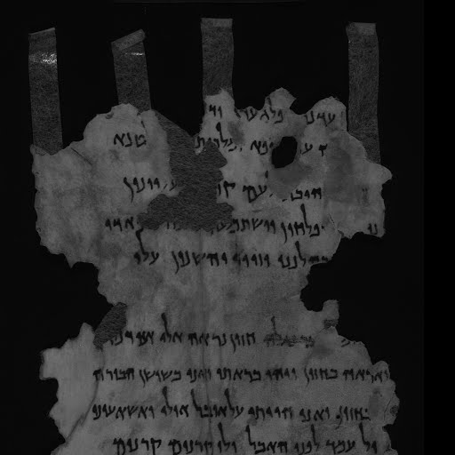

= Overview of Daniel Chapter 8 and Its Fulfillment in History

== Daniel Chapter 8

Daniel Chapter 8 contains a vision given to the prophet Daniel during the third year of King Belshazzar's reign. The vision is of a ram and a goat, which are interpreted by the angel Gabriel.

=== The Vision

- **The Ram**: The ram has two horns, **one longer than the other**, representing the kings of Media and Persia. Media was the first kingdom to rise to power, followed by Persia, which became the dominant kingdom.

- **The Goat**: The goat has a single prominent horn between its eyes, symbolizing the first king of Greece (Alexander the Great). The goat (Alexander the Great) defeats the ram (Media and Persia), and the goats prominent horn is broken (Alexander the Great dies) who is then replaced by four notable horns, representing the division of Alexander's empire among his four generals.

- **Cassander**: Took control of Macedonia and Greece.
- **Lysimachus**: Governed Thrace and parts of Asia Minor.
- **Ptolemy**: Ruled over Egypt and neighboring regions.
- **Seleucus**: Controlled the bulk of Alexander's Asian territories, including Syria and Persia.

=== Interpretation

Gabriel explains that the vision pertains to the "time of the end" and the "appointed time of wrath." The ram represents the Medo-Persian Empire, and the goat represents the Greek Empire. The large horn is Alexander the Great, and the four horns are the four kingdoms that arose after his death which preceeded from his four generals.

== Historical Fulfillment
These prophecies were fulfilled in history as follows:

- **Medo-Persian Empire**: The ram with two horns symbolizes the Medo-Persian Empire, which was a significant power in the ancient Near East.

- **Greek Empire**: The goat represents the Greek Empire under Alexander the Great, who swiftly conquered the Medo-Persian Empire.

- **Division of Alexander's Empire**: After Alexander's death, his empire was divided among his four generals: Cassander, Lysimachus, Ptolemy, and Seleucus.

== Qumran Discovery

The discovery of the Dead Sea Scrolls at Qumran in the mid-20th century **included fragments of the Book of Daniel**. These scrolls date back to the **late 2nd century BC**, providing evidence that the Book of Daniel was considered canonical and authoritative by the Jewish community at that time. **This obliterates the former criticisms that the Book of Daniel was written after the events it prophesied**.

== Conclusion

Daniel Chapter 8 provides a prophetic vision that aligns with historical events involving the Medo-Persian and Greek empires. The Qumran discovery further supports the canonical status of the Book of Daniel in ancient Jewish tradition.